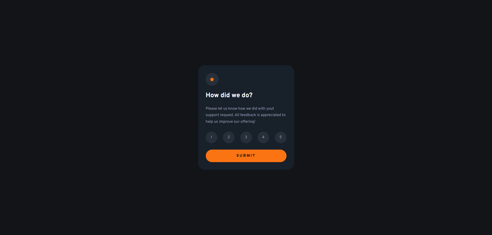

# Frontend Mentor - Interactive rating component solution

This is a solution to the [Interactive rating component challenge on Frontend Mentor](https://www.frontendmentor.io/challenges/interactive-rating-component-koxpeBUmI). Frontend Mentor challenges help you improve your coding skills by building realistic projects. 

## Table of contents

- [Overview](#overview)
  - [The challenge](#the-challenge)
  - [Screenshot](#screenshot)
  - [Links](#links)
- [My process](#my-process)
  - [Built with](#built-with)
  - [What I learned](#what-i-learned)
  - [Continued development](#continued-development)
  - [Useful resources](#useful-resources)
- [Author](#author)

## Overview

### The challenge

Users should be able to:

- View the optimal layout for the app depending on their device's screen size
- See hover states for all interactive elements on the page
- Select and submit a number rating
- See the "Thank you" card state after submitting a rating

### Screenshot




### Links

- Solution URL: [GitHub Repo](https://github.com/AlexanderTejedor/Interactive-rating-component)
- Live Site URL: [GitHub Pages](https://alexandertejedor.github.io/Interactive-rating-component/)

## My process

### Built with

- Semantic HTML5 markup
- CSS custom properties
- JavaScript
- Flexbox
- CSS Grid
- Mobile-first workflow

### What I learned

In this challenge, I learned a lot about basic JavaScript. I learned how to add elements to HTML from JavaScript, how to add classes to those elements, and how to clear an entire container to remove the elements contained within it. I also learned how to enable and disable the submit button if a condition is not met. I learned many things today. I know there might be an easier or even more optimal way, but I feel proud of my progress.

```js
//With this line of code, I removed all the elements from a container:
const container = document.getElementById('card-content');
container.innerHTML = '';

//Here is an example of how I learned to create elements and add classes to them:
const title = document.createElement('h1');
title.textContent = 'Thank you!';
container.appendChild(title);
title.classList.add('card-title-two');

//Here is how I enabled and disabled the button:
const btn = document.getElementById('card-btn');
btn.disabled = true;
btn.disabled = false;

```

### Continued development

I will continue learning and implementing better practices with JavaScript to keep achieving these fabulous results. 😍

### Useful resources

- [Deshabilitar un botón con CSS o JavaScript](https://www.esthersola.com/deshabilitar-un-boton-con-css-o-javascript/#:~:text=Para%20anular%20la%20funcionalidad%20de,y%20modificar%20el%20atributo%20disabled.) - Here I learned how to disable and enable a button.
- [Eliminar contenido de un div al hacer click](https://desarrolloweb.com/faq/eliminar-contenido-div-click) - Removing the content of a div when clicked:
- [Crear elementos en el DOM](https://lenguajejs.com/javascript/dom/crear-elementos-dom/) - Creating elements in the DOM
- [Document.createElement()](https://developer.mozilla.org/es/docs/Web/API/Document/createElement) - 
I used this resource to learn how to create elements.
- [Cambiar dinámicamente una imagen con JavaScript](https://lineadecodigo.com/javascript/cambiar-dinamicamente-una-imagen-con-javascript/) - Here's an example of how I learned to add images.
- [Google Fonts](https://fonts.google.com/) - This helped me to use external fonts instead of local ones, so that everyone can identify the type of font I used for this challenge.


## Author

- Website - [Alexander Tejedor](https://github.com/AlexanderTejedor)
- Frontend Mentor - [@AlexanderTejedor](https://www.frontendmentor.io/profile/AlexanderTejedor)
- Twitter - [@Alexand59894016](https://x.com/Alexand59894016)
- Instagram - [___.alexDev.___](https://www.instagram.com/___.alexdev.___/)